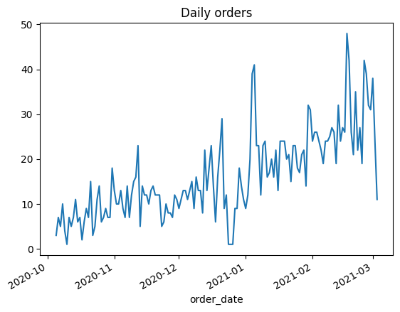
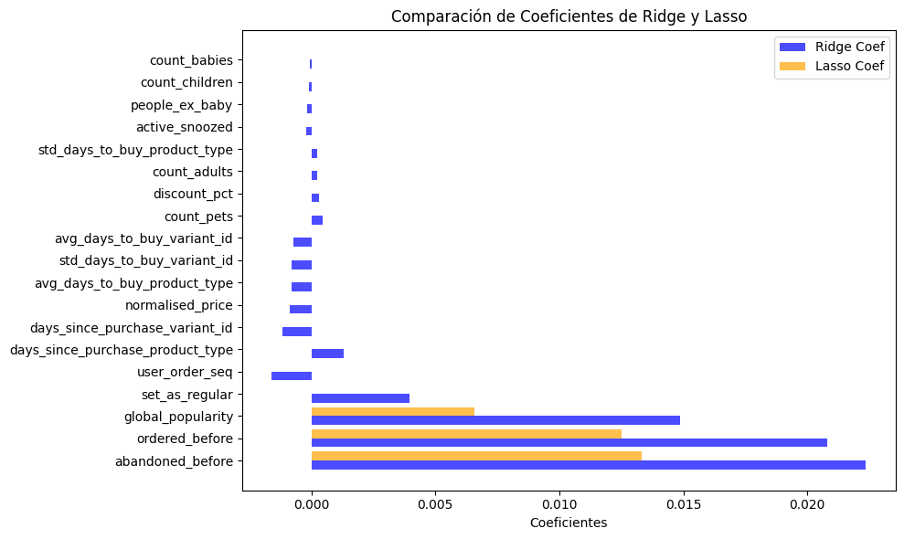
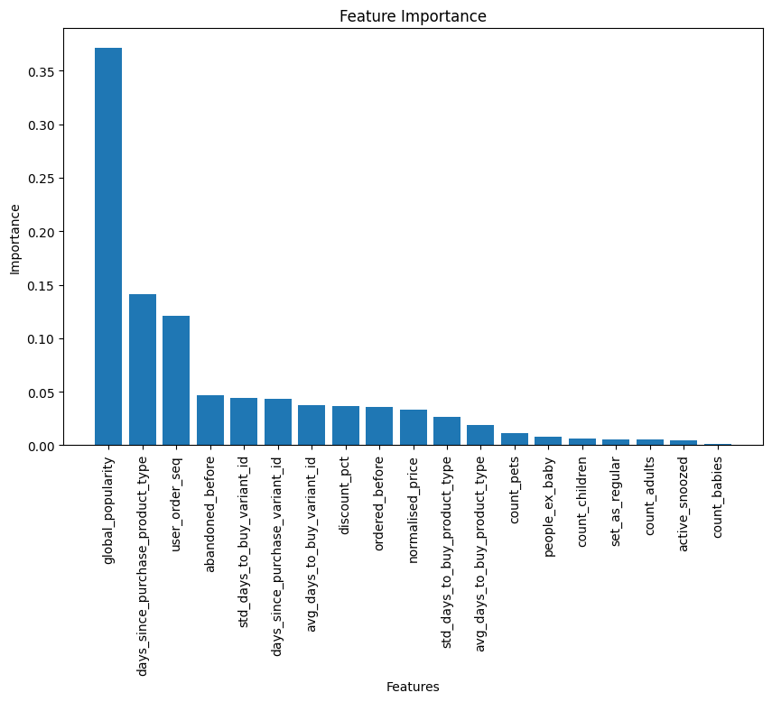
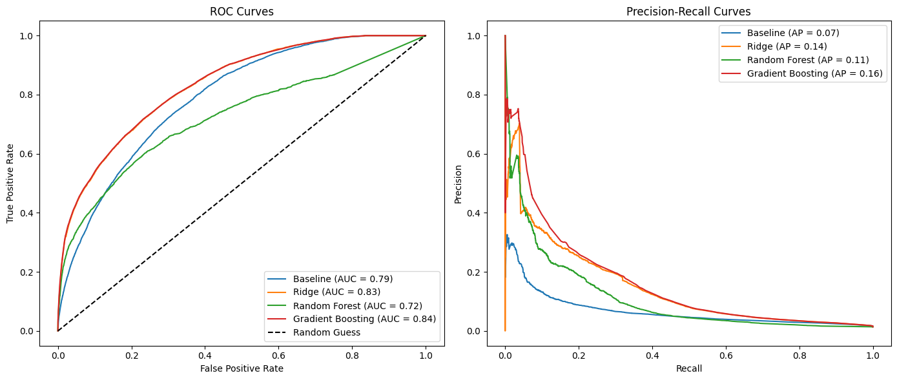

# MODULE 4

In this module, we are developing non-linear models to find the best model that fits with feature_frame CSV. We are implementing new algorithms to complete the module_3's analysis.

- Baseline
- Linear Regression
- Decision Tree
- Random Forest
- Descent Gradiente


```python
import pandas as pd
import numpy as np
import matplotlib.pyplot as plt
import seaborn as sns
from sklearn.preprocessing import StandardScaler, OneHotEncoder
from sklearn.compose import ColumnTransformer
from sklearn.metrics import roc_curve, precision_recall_curve, average_precision_score, roc_auc_score, auc
from sklearn.linear_model import Ridge, Lasso, LogisticRegression
from sklearn.pipeline import make_pipeline
from sklearn.tree import DecisionTreeClassifier
from sklearn.ensemble import RandomForestClassifier, GradientBoostingClassifier
```


```python
df = pd.read_csv('../../data/feature_frame.csv')
```


```python
df.dropna().head()
```


<div>
<style scoped>
    .dataframe tbody tr th:only-of-type {
        vertical-align: middle;
    }

    .dataframe tbody tr th {
        vertical-align: top;
    }

    .dataframe thead th {
        text-align: right;
    }
</style>
<table border="1" class="dataframe">
  <thead>
    <tr style="text-align: right;">
      <th></th>
      <th>variant_id</th>
      <th>product_type</th>
      <th>order_id</th>
      <th>user_id</th>
      <th>created_at</th>
      <th>order_date</th>
      <th>user_order_seq</th>
      <th>outcome</th>
      <th>ordered_before</th>
      <th>abandoned_before</th>
      <th>...</th>
      <th>count_children</th>
      <th>count_babies</th>
      <th>count_pets</th>
      <th>people_ex_baby</th>
      <th>days_since_purchase_variant_id</th>
      <th>avg_days_to_buy_variant_id</th>
      <th>std_days_to_buy_variant_id</th>
      <th>days_since_purchase_product_type</th>
      <th>avg_days_to_buy_product_type</th>
      <th>std_days_to_buy_product_type</th>
    </tr>
  </thead>
  <tbody>
    <tr>
      <th>0</th>
      <td>33826472919172</td>
      <td>ricepastapulses</td>
      <td>2807985930372</td>
      <td>3482464092292</td>
      <td>2020-10-05 16:46:19</td>
      <td>2020-10-05 00:00:00</td>
      <td>3</td>
      <td>0.0</td>
      <td>0.0</td>
      <td>0.0</td>
      <td>...</td>
      <td>0.0</td>
      <td>0.0</td>
      <td>0.0</td>
      <td>2.0</td>
      <td>33.0</td>
      <td>42.0</td>
      <td>31.134053</td>
      <td>30.0</td>
      <td>30.0</td>
      <td>24.27618</td>
    </tr>
    <tr>
      <th>1</th>
      <td>33826472919172</td>
      <td>ricepastapulses</td>
      <td>2808027644036</td>
      <td>3466586718340</td>
      <td>2020-10-05 17:59:51</td>
      <td>2020-10-05 00:00:00</td>
      <td>2</td>
      <td>0.0</td>
      <td>0.0</td>
      <td>0.0</td>
      <td>...</td>
      <td>0.0</td>
      <td>0.0</td>
      <td>0.0</td>
      <td>2.0</td>
      <td>33.0</td>
      <td>42.0</td>
      <td>31.134053</td>
      <td>30.0</td>
      <td>30.0</td>
      <td>24.27618</td>
    </tr>
    <tr>
      <th>2</th>
      <td>33826472919172</td>
      <td>ricepastapulses</td>
      <td>2808099078276</td>
      <td>3481384026244</td>
      <td>2020-10-05 20:08:53</td>
      <td>2020-10-05 00:00:00</td>
      <td>4</td>
      <td>0.0</td>
      <td>0.0</td>
      <td>0.0</td>
      <td>...</td>
      <td>0.0</td>
      <td>0.0</td>
      <td>0.0</td>
      <td>2.0</td>
      <td>33.0</td>
      <td>42.0</td>
      <td>31.134053</td>
      <td>30.0</td>
      <td>30.0</td>
      <td>24.27618</td>
    </tr>
    <tr>
      <th>3</th>
      <td>33826472919172</td>
      <td>ricepastapulses</td>
      <td>2808393957508</td>
      <td>3291363377284</td>
      <td>2020-10-06 08:57:59</td>
      <td>2020-10-06 00:00:00</td>
      <td>2</td>
      <td>0.0</td>
      <td>0.0</td>
      <td>0.0</td>
      <td>...</td>
      <td>0.0</td>
      <td>0.0</td>
      <td>0.0</td>
      <td>2.0</td>
      <td>33.0</td>
      <td>42.0</td>
      <td>31.134053</td>
      <td>30.0</td>
      <td>30.0</td>
      <td>24.27618</td>
    </tr>
    <tr>
      <th>4</th>
      <td>33826472919172</td>
      <td>ricepastapulses</td>
      <td>2808429314180</td>
      <td>3537167515780</td>
      <td>2020-10-06 10:37:05</td>
      <td>2020-10-06 00:00:00</td>
      <td>3</td>
      <td>0.0</td>
      <td>0.0</td>
      <td>0.0</td>
      <td>...</td>
      <td>0.0</td>
      <td>0.0</td>
      <td>0.0</td>
      <td>2.0</td>
      <td>33.0</td>
      <td>42.0</td>
      <td>31.134053</td>
      <td>30.0</td>
      <td>30.0</td>
      <td>24.27618</td>
    </tr>
  </tbody>
</table>
<p>5 rows × 27 columns</p>
</div>


```python
df.columns
df.info()
```

    <class 'pandas.core.frame.DataFrame'>
    RangeIndex: 2880549 entries, 0 to 2880548
    Data columns (total 27 columns):
     #   Column                            Dtype  
    ---  ------                            -----  
     0   variant_id                        int64  
     1   product_type                      object 
     2   order_id                          int64  
     3   user_id                           int64  
     4   created_at                        object 
     5   order_date                        object 
     6   user_order_seq                    int64  
     7   outcome                           float64
     8   ordered_before                    float64
     9   abandoned_before                  float64
     10  active_snoozed                    float64
     11  set_as_regular                    float64
     12  normalised_price                  float64
     13  discount_pct                      float64
     14  vendor                            object 
     15  global_popularity                 float64
     16  count_adults                      float64
     17  count_children                    float64
     18  count_babies                      float64
     19  count_pets                        float64
     20  people_ex_baby                    float64
     21  days_since_purchase_variant_id    float64
     22  avg_days_to_buy_variant_id        float64
     23  std_days_to_buy_variant_id        float64
     24  days_since_purchase_product_type  float64
     25  avg_days_to_buy_product_type      float64
     26  std_days_to_buy_product_type      float64
    dtypes: float64(19), int64(4), object(4)
    memory usage: 593.4+ MB


```python
info_cols = ['variant_id', 'order_id', 'user_id', 'created_at', 'order_date']
label_col = 'outcome'
feature_cols = {col for col in df if col not in info_cols + [label_col]}

categorical_cols = ['product_type', 'vendor']
binary_cols= ['ordered_before', 'abandoned_before', 'active_snoozed', 'set_as_regular']
numerical_cols = {col for col in feature_cols if col not in categorical_cols + binary_cols}
```


```python
df[label_col].value_counts()
```


    outcome
    0.0    2847317
    1.0      33232
    Name: count, dtype: int64


```python
# get those orders with more than 5 products

items_per_order = df.groupby('order_id').outcome.sum()
big_orders = items_per_order[items_per_order > 5].index

df_2 = df[df['order_id'].isin(big_orders)]
```


```python
test_df = df_2.groupby('order_id').outcome.sum()
test_df.head(10)
```


    order_id
    2807985930372     9.0
    2808027644036     6.0
    2808099078276     9.0
    2808393957508    13.0
    2808434524292     7.0
    2808548917380     7.0
    2808549900420     9.0
    2808728715396    12.0
    2808769085572    15.0
    2808786714756    16.0
    Name: outcome, dtype: float64


```python
df_2['order_date'] = pd.to_datetime(df_2['order_date'])
```

    /tmp/ipykernel_1801/1778527225.py:1: SettingWithCopyWarning: 
    A value is trying to be set on a copy of a slice from a DataFrame.
    Try using .loc[row_indexer,col_indexer] = value instead
    
    See the caveats in the documentation: https://pandas.pydata.org/pandas-docs/stable/user_guide/indexing.html#returning-a-view-versus-a-copy
      df_2['order_date'] = pd.to_datetime(df_2['order_date'])


```python
daily_orders = df_2.groupby('order_date').order_id.nunique()

daily_orders.head()
```


    order_date
    2020-10-05     3
    2020-10-06     7
    2020-10-07     5
    2020-10-08    10
    2020-10-09     4
    Name: order_id, dtype: int64


```python
daily_orders.plot()
plt.title('Daily orders')
```


    Text(0.5, 1.0, 'Daily orders')


    

    


```python
df_2 = df_2.sort_values(by='order_date')
```


```python
n_total = len(df_2)
n_train = int(0.6 * n_total)
n_val = int (0.2 * n_total)

train_df = df_2[:n_train]
val_df = df_2[n_train:n_train + n_val]
test_df = df_2[n_train + n_val:]
```


```python
predictive_cols = binary_cols + list(numerical_cols)
```


```python
X_train = train_df[predictive_cols]
y_train = train_df[label_col]

X_val = val_df[predictive_cols]
y_val = val_df[label_col]

X_test = test_df[predictive_cols]
y_test = test_df[label_col]
```


```python
print(f'X_train shape: {X_train.shape}, y_train shape: {y_train.shape}')
print(f'X_val shape: {X_val.shape}, y_val shape: {y_val.shape}')
print(f'X_test shape: {X_test.shape}, y_test shape: {y_test.shape}')
```

    X_train shape: (1213830, 19), y_train shape: (1213830,)
    X_val shape: (404610, 19), y_val shape: (404610,)
    X_test shape: (404610, 19), y_test shape: (404610,)


```python
# it's not OK because we need to scale with mean and std just of the train data

scaler = StandardScaler()
X_train_scaled = scaler.fit_transform(X_train)
X_val_scaled = scaler.fit_transform(X_val)
X_test_scaled = scaler.fit_transform(X_test)
```

# 1. Baseline
- Let's implement a first baseline by using global_popularity


```python
y_train_pred_proba = X_train['global_popularity']
y_val_pred_proba = X_val['global_popularity']

fpr_train, tpr_train, _ = roc_curve(y_train, y_train_pred_proba)
auc_train = auc(fpr_train, tpr_train)
fpr_val, tpr_val, _ = roc_curve(y_val, y_val_pred_proba)
auc_val = auc(fpr_val, tpr_val)

precision_train, recall_train, _ = precision_recall_curve(y_train, y_train_pred_proba)
pr_auc_train = average_precision_score(y_train, y_train_pred_proba)
precision_val, recall_val, _ = precision_recall_curve(y_val, y_val_pred_proba)
pr_auc_val = average_precision_score(y_val, y_val_pred_proba)

print(f'ROC AUC Train: {auc_train:.2f}')
print(f'ROC AUC Validation: {auc_val:.2f}')
print(f'Precision-Recall AUC Train: {pr_auc_train:.2f}')
print(f'Precision-Recall AUC Validation: {pr_auc_val:.2f}')
```

    ROC AUC Train: 0.79
    ROC AUC Validation: 0.79
    Precision-Recall AUC Train: 0.06
    Precision-Recall AUC Validation: 0.07


# 2. Linear Models

- Let's implement now a linear regression model
- First, with Ridge Regression with some different regularization values
- Then, with Lasso Regression also with different values.
- We're gonna see if we imporve the baseline.


```python
cs = [0.0000001, 0.00001, 0.01, 1, 100, 10000, None]

for c in cs:
    model = make_pipeline(
        StandardScaler(),
        LogisticRegression(penalty='l2' if c else None, C=c if c else 1.0)
    )
    
    model.fit(X_train, y_train)
    
    y_train_pred = model.predict_proba(X_train)[:, 1]
    y_val_pred = model.predict_proba(X_val)[:, 1]
    
    fpr_train, tpr_train, _ = roc_curve(y_train, y_train_pred)
    fpr_val, tpr_val, _ = roc_curve(y_val, y_val_pred)
    roc_auc_train = auc(fpr_train, tpr_train)
    roc_auc_val = auc(fpr_val, tpr_val)
    
    precision_train, recall_train, _ = precision_recall_curve(y_train, y_train_pred)
    precision_val, recall_val, _ = precision_recall_curve(y_val, y_val_pred)
    pr_auc_train = average_precision_score(y_train, y_train_pred)
    pr_auc_val = average_precision_score(y_val, y_val_pred)
    
    print(f'Para C = {c}:')
    print(f'  ROC AUC Train: {roc_auc_train:.2f}')
    print(f'  ROC AUC Validation: {roc_auc_val:.2f}')
    print(f'  Precision-Recall AUC Train: {pr_auc_train:.2f}')
    print(f'  Precision-Recall AUC Validation: {pr_auc_val:.2f}')
    print('-' * 50)
```

    Para C = 1e-07:
      ROC AUC Train: 0.83
      ROC AUC Validation: 0.83
      Precision-Recall AUC Train: 0.16
      Precision-Recall AUC Validation: 0.15
    --------------------------------------------------
    Para C = 1e-05:
      ROC AUC Train: 0.83
      ROC AUC Validation: 0.83
      Precision-Recall AUC Train: 0.16
      Precision-Recall AUC Validation: 0.15
    --------------------------------------------------
    Para C = 0.01:
      ROC AUC Train: 0.80
      ROC AUC Validation: 0.81
      Precision-Recall AUC Train: 0.16
      Precision-Recall AUC Validation: 0.15
    --------------------------------------------------
    Para C = 1:
      ROC AUC Train: 0.80
      ROC AUC Validation: 0.81
      Precision-Recall AUC Train: 0.16
      Precision-Recall AUC Validation: 0.15
    --------------------------------------------------
    Para C = 100:
      ROC AUC Train: 0.80
      ROC AUC Validation: 0.81
      Precision-Recall AUC Train: 0.16
      Precision-Recall AUC Validation: 0.15
    --------------------------------------------------
    Para C = 10000:
      ROC AUC Train: 0.80
      ROC AUC Validation: 0.81
      Precision-Recall AUC Train: 0.16
      Precision-Recall AUC Validation: 0.15
    --------------------------------------------------
    Para C = None:
      ROC AUC Train: 0.80
      ROC AUC Validation: 0.81
      Precision-Recall AUC Train: 0.16
      Precision-Recall AUC Validation: 0.15
    --------------------------------------------------


Ridge best => alpha = 1e-07

Now, let's try Lasso


```python
cs = [0.0000001, 0.00001, 0.01, 1, 100, 10000, None]

for c in cs:
    model = make_pipeline(
        StandardScaler(),
        LogisticRegression(penalty='l1' if c else None, C=c if c else 1.0, solver='saga')
    )
    
    model.fit(X_train, y_train)
    
    y_train_pred = model.predict_proba(X_train)[:, 1]
    y_val_pred = model.predict_proba(X_val)[:, 1]
    
    fpr_train, tpr_train, _ = roc_curve(y_train, y_train_pred)
    fpr_val, tpr_val, _ = roc_curve(y_val, y_val_pred)
    roc_auc_train = auc(fpr_train, tpr_train)
    roc_auc_val = auc(fpr_val, tpr_val)
    
    precision_train, recall_train, _ = precision_recall_curve(y_train, y_train_pred)
    precision_val, recall_val, _ = precision_recall_curve(y_val, y_val_pred)
    pr_auc_train = average_precision_score(y_train, y_train_pred)
    pr_auc_val = average_precision_score(y_val, y_val_pred)
    
    print(f'Para C = {c}:')
    print(f'  ROC AUC Train: {roc_auc_train:.2f}')
    print(f'  ROC AUC Validation: {roc_auc_val:.2f}')
    print(f'  Precision-Recall AUC Train: {pr_auc_train:.2f}')
    print(f'  Precision-Recall AUC Validation: {pr_auc_val:.2f}')
    print('-' * 50)
```

    Para C = 1e-07:
      ROC AUC Train: 0.50
      ROC AUC Validation: 0.50
      Precision-Recall AUC Train: 0.02
      Precision-Recall AUC Validation: 0.01
    --------------------------------------------------
    Para C = 1e-05:
      ROC AUC Train: 0.50
      ROC AUC Validation: 0.50
      Precision-Recall AUC Train: 0.02
      Precision-Recall AUC Validation: 0.01
    --------------------------------------------------
    Para C = 0.01:
      ROC AUC Train: 0.80
      ROC AUC Validation: 0.81
      Precision-Recall AUC Train: 0.16
      Precision-Recall AUC Validation: 0.15
    --------------------------------------------------
    Para C = 1:
      ROC AUC Train: 0.80
      ROC AUC Validation: 0.81
      Precision-Recall AUC Train: 0.16
      Precision-Recall AUC Validation: 0.15
    --------------------------------------------------
    Para C = 100:
      ROC AUC Train: 0.80
      ROC AUC Validation: 0.81
      Precision-Recall AUC Train: 0.16
      Precision-Recall AUC Validation: 0.15
    --------------------------------------------------
    Para C = 10000:
      ROC AUC Train: 0.80
      ROC AUC Validation: 0.81
      Precision-Recall AUC Train: 0.16
      Precision-Recall AUC Validation: 0.15
    --------------------------------------------------
    Para C = None:
      ROC AUC Train: 0.80
      ROC AUC Validation: 0.81
      Precision-Recall AUC Train: 0.16
      Precision-Recall AUC Validation: 0.15
    --------------------------------------------------


- Very small values in Lasso regularization lead to poor results. 
- Starting from 0.01, the values become similar to Ridge, but Ridge is a little bit better.
- Additionally, as observed, this regularization doesn't contribute much, and without it, we achieve very similar results. 
- Therefore, it might be a better option to apply linear regression without regularization, as we obtain almost identical results without the need for any additional techniques.
- The dataset is large enough to don't need any regularization


```python
alpha_ridge = 1e-07
alpha_lasso = 0.01

ridge = make_pipeline(StandardScaler(), Ridge(alpha=alpha_ridge)) 
lasso = make_pipeline(StandardScaler(), Lasso(alpha=alpha_lasso))

ridge.fit(X_train, y_train)
lasso.fit(X_train, y_train)

ridge_coef = ridge.named_steps['ridge'].coef_
lasso_coef = lasso.named_steps['lasso'].coef_

coef_df = pd.DataFrame({
    'Feature': X_train.columns,
    'Ridge Coef': ridge_coef,
    'Lasso Coef': lasso_coef
})

coef_df['Abs Ridge Coef'] = np.abs(coef_df['Ridge Coef'])
coef_df['Abs Lasso Coef'] = np.abs(coef_df['Lasso Coef'])
coef_df = coef_df.sort_values(by=['Abs Ridge Coef', 'Abs Lasso Coef'], ascending=False)

print(coef_df[['Feature', 'Ridge Coef', 'Lasso Coef']])

plt.figure(figsize=(10, 6))

bar_width = 0.4  
index = np.arange(len(coef_df))

plt.barh(index - bar_width/2, coef_df['Ridge Coef'], bar_width, color='blue', alpha=0.7, label='Ridge Coef')

plt.barh(index + bar_width/2, coef_df['Lasso Coef'], bar_width, color='orange', alpha=0.7, label='Lasso Coef')

plt.xlabel('Coeficientes')
plt.title('Comparación de Coeficientes de Ridge y Lasso')
plt.yticks(index, coef_df['Feature'])
plt.legend()

plt.tight_layout()
plt.show()
```

                                 Feature  Ridge Coef  Lasso Coef
    1                   abandoned_before    0.022370    0.013324
    0                     ordered_before    0.020805    0.012507
    8                  global_popularity    0.014860    0.006563
    3                     set_as_regular    0.003956    0.000000
    16                    user_order_seq   -0.001588   -0.000000
    12  days_since_purchase_product_type    0.001290    0.000000
    9     days_since_purchase_variant_id   -0.001157   -0.000000
    15                  normalised_price   -0.000886   -0.000000
    14      avg_days_to_buy_product_type   -0.000792   -0.000000
    10        std_days_to_buy_variant_id   -0.000789   -0.000000
    18        avg_days_to_buy_variant_id   -0.000707   -0.000000
    5                         count_pets    0.000468    0.000000
    7                       discount_pct    0.000314    0.000000
    17                      count_adults    0.000234    0.000000
    13      std_days_to_buy_product_type    0.000229   -0.000000
    2                     active_snoozed   -0.000196    0.000000
    11                    people_ex_baby   -0.000151    0.000000
    4                     count_children   -0.000097   -0.000000
    6                       count_babies   -0.000047   -0.000000


    

    


- Lasso only uses three features, and Ridge uses mainly the same three. We can try to develop a model by using just this three features


```python
top_cols = ['abandoned_before', 'ordered_before', 'global_popularity']
```


```python
X_train_top = X_train[top_cols]
X_val_top = X_val[top_cols]
```


```python
alpha_ridge = 1e-07

ridge = make_pipeline(StandardScaler(), Ridge(alpha=alpha_ridge))
ridge.fit(X_train_top, y_train)

y_train_pred = ridge.predict(X_train_top)
y_val_pred = ridge.predict(X_val_top)

fpr_train, tpr_train, _ = roc_curve(y_train, y_train_pred)
roc_auc_train = auc(fpr_train, tpr_train)

fpr_val, tpr_val, _ = roc_curve(y_val, y_val_pred)
roc_auc_val = auc(fpr_val, tpr_val)

precision_train, recall_train, _ = precision_recall_curve(y_train, y_train_pred)
pr_auc_train = auc(recall_train, precision_train)

precision_val, recall_val, _ = precision_recall_curve(y_val, y_val_pred)
pr_auc_val = auc(recall_val, precision_val)

print(f"Ridge Regression with alpha = {alpha_ridge}")
print(f"ROC AUC for Train: {roc_auc_train:.2f}")
print(f"ROC AUC for Validation: {roc_auc_val:.2f}")
print(f"PR AUC for Train: {pr_auc_train:.2f}")
print(f"PR AUC for Validation: {pr_auc_val:.2f}")
```

    Ridge Regression with alpha = 1e-07
    ROC AUC for Train: 0.83
    ROC AUC for Validation: 0.83
    PR AUC for Train: 0.17
    PR AUC for Validation: 0.14


- We find that with less features we get the same results. Because Lasso and Ridge have similar results (but Ridge a little bit better) we set Ridge with 1e-07 regularization as the best option.
- We can also try to include some categorical features

BEST LINEAR MODEL => Ridge (alpha = 1e-07) with top_cols

# Non-linear models

Now that we've got better results with a linear regression than the baseline, let's see if we can improve it by using different non-linear models

# 3. Decision tree

We are gonna try to get better metrics by trying to implement decision trees with different max_depth values


```python
max_depth_values = [1, 2, 4, 8, 12, 20]
roc_auc_train = []
roc_auc_val = []
pr_auc_train = []
pr_auc_val = []

for depth in max_depth_values:
    tree_clf = DecisionTreeClassifier(max_depth=depth, random_state=42)

    tree_clf.fit(X_train, y_train)

    y_train_pred_proba = tree_clf.predict_proba(X_train)[:, 1]
    y_val_pred_proba = tree_clf.predict_proba(X_val)[:, 1]

    roc_auc_train.append(roc_auc_score(y_train, y_train_pred_proba))
    roc_auc_val.append(roc_auc_score(y_val, y_val_pred_proba))

    pr_auc_train.append(average_precision_score(y_train, y_train_pred_proba))
    pr_auc_val.append(average_precision_score(y_val, y_val_pred_proba))

for depth, train_roc_auc, val_roc_auc, train_pr_auc, val_pr_auc in zip(max_depth_values, roc_auc_train, roc_auc_val, pr_auc_train, pr_auc_val):
    print(f"max_depth = {depth}:")
    print(f"  ROC AUC Train: {train_roc_auc:.4f}")
    print(f"  ROC AUC Val: {val_roc_auc:.4f}")
    print(f"  PR AUC Train: {train_pr_auc:.4f}")
    print(f"  PR AUC Val: {val_pr_auc:.4f}")
    print('-' * 50)
```

    max_depth = 1:
      ROC AUC Train: 0.5248
      ROC AUC Val: 0.5099
      PR AUC Train: 0.0536
      PR AUC Val: 0.0266
    --------------------------------------------------
    max_depth = 2:
      ROC AUC Train: 0.6453
      ROC AUC Val: 0.6477
      PR AUC Train: 0.0993
      PR AUC Val: 0.0764
    --------------------------------------------------
    max_depth = 4:
      ROC AUC Train: 0.8145
      ROC AUC Val: 0.8133
      PR AUC Train: 0.1509
      PR AUC Val: 0.1258
    --------------------------------------------------
    max_depth = 8:
      ROC AUC Train: 0.8359
      ROC AUC Val: 0.8255
      PR AUC Train: 0.1975
      PR AUC Val: 0.1285
    --------------------------------------------------
    max_depth = 12:
      ROC AUC Train: 0.8466
      ROC AUC Val: 0.8047
      PR AUC Train: 0.2454
      PR AUC Val: 0.0966
    --------------------------------------------------
    max_depth = 20:
      ROC AUC Train: 0.9063
      ROC AUC Val: 0.6632
      PR AUC Train: 0.4480
      PR AUC Val: 0.0543
    --------------------------------------------------


# 4. Random Forest

Now, let's implement Random Forest with different n_estimators values 


```python
n_estimators_values = [10, 20, 50, 100]

for n_estimators in n_estimators_values:
    rf_clf = RandomForestClassifier(n_estimators=n_estimators, random_state=42)
    rf_clf.fit(X_train, y_train)

    y_train_proba = rf_clf.predict_proba(X_train)[:, 1]
    y_val_proba = rf_clf.predict_proba(X_val)[:, 1]

    fpr_train, tpr_train, _ = roc_curve(y_train, y_train_proba)
    roc_auc_train = auc(fpr_train, tpr_train)

    precision_train, recall_train, _ = precision_recall_curve(y_train, y_train_proba)
    pr_auc_train = auc(recall_train, precision_train)

    fpr_val, tpr_val, _ = roc_curve(y_val, y_val_proba)
    roc_auc_val = auc(fpr_val, tpr_val)

    precision_val, recall_val, _ = precision_recall_curve(y_val, y_val_proba)
    pr_auc_val = auc(recall_val, precision_val)

    print(f"n_estimators = {n_estimators}:")
    print(f"  Train ROC AUC: {roc_auc_train:.4f}")
    print(f"  Validation ROC AUC: {roc_auc_val:.4f}")
    print(f"  Train Precision-Recall AUC: {pr_auc_train:.4f}")
    print(f"  Validation Precision-Recall AUC: {pr_auc_val:.4f}")
    print('-' * 50)
```

    n_estimators = 10:
      Train ROC AUC: 0.9942
      Validation ROC AUC: 0.6792
      Train Precision-Recall AUC: 0.8330
      Validation Precision-Recall AUC: 0.1063
    --------------------------------------------------
    n_estimators = 20:
      Train ROC AUC: 0.9953
      Validation ROC AUC: 0.7053
      Train Precision-Recall AUC: 0.8560
      Validation Precision-Recall AUC: 0.1138
    --------------------------------------------------
    n_estimators = 50:
      Train ROC AUC: 0.9958
      Validation ROC AUC: 0.7345
      Train Precision-Recall AUC: 0.8675
      Validation Precision-Recall AUC: 0.1181
    --------------------------------------------------
    n_estimators = 100:
      Train ROC AUC: 0.9959
      Validation ROC AUC: 0.7509
      Train Precision-Recall AUC: 0.8706
      Validation Precision-Recall AUC: 0.1194
    --------------------------------------------------


- Seems that there is so much variance, a low number of trees gives a very high error, so maybe it is necessary to add more trees.
- Let's try to remove features with less importance


```python
rf = RandomForestClassifier(100)
rf.fit(X_train, y_train)
```


<style>#sk-container-id-1 {
  /* Definition of color scheme common for light and dark mode */
  --sklearn-color-text: black;
  --sklearn-color-line: gray;
  /* Definition of color scheme for unfitted estimators */
  --sklearn-color-unfitted-level-0: #fff5e6;
  --sklearn-color-unfitted-level-1: #f6e4d2;
  --sklearn-color-unfitted-level-2: #ffe0b3;
  --sklearn-color-unfitted-level-3: chocolate;
  /* Definition of color scheme for fitted estimators */
  --sklearn-color-fitted-level-0: #f0f8ff;
  --sklearn-color-fitted-level-1: #d4ebff;
  --sklearn-color-fitted-level-2: #b3dbfd;
  --sklearn-color-fitted-level-3: cornflowerblue;

  /* Specific color for light theme */
  --sklearn-color-text-on-default-background: var(--sg-text-color, var(--theme-code-foreground, var(--jp-content-font-color1, black)));
  --sklearn-color-background: var(--sg-background-color, var(--theme-background, var(--jp-layout-color0, white)));
  --sklearn-color-border-box: var(--sg-text-color, var(--theme-code-foreground, var(--jp-content-font-color1, black)));
  --sklearn-color-icon: #696969;

  @media (prefers-color-scheme: dark) {
    /* Redefinition of color scheme for dark theme */
    --sklearn-color-text-on-default-background: var(--sg-text-color, var(--theme-code-foreground, var(--jp-content-font-color1, white)));
    --sklearn-color-background: var(--sg-background-color, var(--theme-background, var(--jp-layout-color0, #111)));
    --sklearn-color-border-box: var(--sg-text-color, var(--theme-code-foreground, var(--jp-content-font-color1, white)));
    --sklearn-color-icon: #878787;
  }
}

#sk-container-id-1 {
  color: var(--sklearn-color-text);
}

#sk-container-id-1 pre {
  padding: 0;
}

#sk-container-id-1 input.sk-hidden--visually {
  border: 0;
  clip: rect(1px 1px 1px 1px);
  clip: rect(1px, 1px, 1px, 1px);
  height: 1px;
  margin: -1px;
  overflow: hidden;
  padding: 0;
  position: absolute;
  width: 1px;
}

#sk-container-id-1 div.sk-dashed-wrapped {
  border: 1px dashed var(--sklearn-color-line);
  margin: 0 0.4em 0.5em 0.4em;
  box-sizing: border-box;
  padding-bottom: 0.4em;
  background-color: var(--sklearn-color-background);
}

#sk-container-id-1 div.sk-container {
  /* jupyter's `normalize.less` sets `[hidden] { display: none; }`
     but bootstrap.min.css set `[hidden] { display: none !important; }`
     so we also need the `!important` here to be able to override the
     default hidden behavior on the sphinx rendered scikit-learn.org.
     See: https://github.com/scikit-learn/scikit-learn/issues/21755 */
  display: inline-block !important;
  position: relative;
}

#sk-container-id-1 div.sk-text-repr-fallback {
  display: none;
}

div.sk-parallel-item,
div.sk-serial,
div.sk-item {
  /* draw centered vertical line to link estimators */
  background-image: linear-gradient(var(--sklearn-color-text-on-default-background), var(--sklearn-color-text-on-default-background));
  background-size: 2px 100%;
  background-repeat: no-repeat;
  background-position: center center;
}

/* Parallel-specific style estimator block */

#sk-container-id-1 div.sk-parallel-item::after {
  content: "";
  width: 100%;
  border-bottom: 2px solid var(--sklearn-color-text-on-default-background);
  flex-grow: 1;
}

#sk-container-id-1 div.sk-parallel {
  display: flex;
  align-items: stretch;
  justify-content: center;
  background-color: var(--sklearn-color-background);
  position: relative;
}

#sk-container-id-1 div.sk-parallel-item {
  display: flex;
  flex-direction: column;
}

#sk-container-id-1 div.sk-parallel-item:first-child::after {
  align-self: flex-end;
  width: 50%;
}

#sk-container-id-1 div.sk-parallel-item:last-child::after {
  align-self: flex-start;
  width: 50%;
}

#sk-container-id-1 div.sk-parallel-item:only-child::after {
  width: 0;
}

/* Serial-specific style estimator block */

#sk-container-id-1 div.sk-serial {
  display: flex;
  flex-direction: column;
  align-items: center;
  background-color: var(--sklearn-color-background);
  padding-right: 1em;
  padding-left: 1em;
}


/* Toggleable style: style used for estimator/Pipeline/ColumnTransformer box that is
clickable and can be expanded/collapsed.
- Pipeline and ColumnTransformer use this feature and define the default style
- Estimators will overwrite some part of the style using the `sk-estimator` class
*/

/* Pipeline and ColumnTransformer style (default) */

#sk-container-id-1 div.sk-toggleable {
  /* Default theme specific background. It is overwritten whether we have a
  specific estimator or a Pipeline/ColumnTransformer */
  background-color: var(--sklearn-color-background);
}

/* Toggleable label */
#sk-container-id-1 label.sk-toggleable__label {
  cursor: pointer;
  display: block;
  width: 100%;
  margin-bottom: 0;
  padding: 0.5em;
  box-sizing: border-box;
  text-align: center;
}

#sk-container-id-1 label.sk-toggleable__label-arrow:before {
  /* Arrow on the left of the label */
  content: "▸";
  float: left;
  margin-right: 0.25em;
  color: var(--sklearn-color-icon);
}

#sk-container-id-1 label.sk-toggleable__label-arrow:hover:before {
  color: var(--sklearn-color-text);
}

/* Toggleable content - dropdown */

#sk-container-id-1 div.sk-toggleable__content {
  max-height: 0;
  max-width: 0;
  overflow: hidden;
  text-align: left;
  /* unfitted */
  background-color: var(--sklearn-color-unfitted-level-0);
}

#sk-container-id-1 div.sk-toggleable__content.fitted {
  /* fitted */
  background-color: var(--sklearn-color-fitted-level-0);
}

#sk-container-id-1 div.sk-toggleable__content pre {
  margin: 0.2em;
  border-radius: 0.25em;
  color: var(--sklearn-color-text);
  /* unfitted */
  background-color: var(--sklearn-color-unfitted-level-0);
}

#sk-container-id-1 div.sk-toggleable__content.fitted pre {
  /* unfitted */
  background-color: var(--sklearn-color-fitted-level-0);
}

#sk-container-id-1 input.sk-toggleable__control:checked~div.sk-toggleable__content {
  /* Expand drop-down */
  max-height: 200px;
  max-width: 100%;
  overflow: auto;
}

#sk-container-id-1 input.sk-toggleable__control:checked~label.sk-toggleable__label-arrow:before {
  content: "▾";
}

/* Pipeline/ColumnTransformer-specific style */

#sk-container-id-1 div.sk-label input.sk-toggleable__control:checked~label.sk-toggleable__label {
  color: var(--sklearn-color-text);
  background-color: var(--sklearn-color-unfitted-level-2);
}

#sk-container-id-1 div.sk-label.fitted input.sk-toggleable__control:checked~label.sk-toggleable__label {
  background-color: var(--sklearn-color-fitted-level-2);
}

/* Estimator-specific style */

/* Colorize estimator box */
#sk-container-id-1 div.sk-estimator input.sk-toggleable__control:checked~label.sk-toggleable__label {
  /* unfitted */
  background-color: var(--sklearn-color-unfitted-level-2);
}

#sk-container-id-1 div.sk-estimator.fitted input.sk-toggleable__control:checked~label.sk-toggleable__label {
  /* fitted */
  background-color: var(--sklearn-color-fitted-level-2);
}

#sk-container-id-1 div.sk-label label.sk-toggleable__label,
#sk-container-id-1 div.sk-label label {
  /* The background is the default theme color */
  color: var(--sklearn-color-text-on-default-background);
}

/* On hover, darken the color of the background */
#sk-container-id-1 div.sk-label:hover label.sk-toggleable__label {
  color: var(--sklearn-color-text);
  background-color: var(--sklearn-color-unfitted-level-2);
}

/* Label box, darken color on hover, fitted */
#sk-container-id-1 div.sk-label.fitted:hover label.sk-toggleable__label.fitted {
  color: var(--sklearn-color-text);
  background-color: var(--sklearn-color-fitted-level-2);
}

/* Estimator label */

#sk-container-id-1 div.sk-label label {
  font-family: monospace;
  font-weight: bold;
  display: inline-block;
  line-height: 1.2em;
}

#sk-container-id-1 div.sk-label-container {
  text-align: center;
}

/* Estimator-specific */
#sk-container-id-1 div.sk-estimator {
  font-family: monospace;
  border: 1px dotted var(--sklearn-color-border-box);
  border-radius: 0.25em;
  box-sizing: border-box;
  margin-bottom: 0.5em;
  /* unfitted */
  background-color: var(--sklearn-color-unfitted-level-0);
}

#sk-container-id-1 div.sk-estimator.fitted {
  /* fitted */
  background-color: var(--sklearn-color-fitted-level-0);
}

/* on hover */
#sk-container-id-1 div.sk-estimator:hover {
  /* unfitted */
  background-color: var(--sklearn-color-unfitted-level-2);
}

#sk-container-id-1 div.sk-estimator.fitted:hover {
  /* fitted */
  background-color: var(--sklearn-color-fitted-level-2);
}

/* Specification for estimator info (e.g. "i" and "?") */

/* Common style for "i" and "?" */

.sk-estimator-doc-link,
a:link.sk-estimator-doc-link,
a:visited.sk-estimator-doc-link {
  float: right;
  font-size: smaller;
  line-height: 1em;
  font-family: monospace;
  background-color: var(--sklearn-color-background);
  border-radius: 1em;
  height: 1em;
  width: 1em;
  text-decoration: none !important;
  margin-left: 1ex;
  /* unfitted */
  border: var(--sklearn-color-unfitted-level-1) 1pt solid;
  color: var(--sklearn-color-unfitted-level-1);
}

.sk-estimator-doc-link.fitted,
a:link.sk-estimator-doc-link.fitted,
a:visited.sk-estimator-doc-link.fitted {
  /* fitted */
  border: var(--sklearn-color-fitted-level-1) 1pt solid;
  color: var(--sklearn-color-fitted-level-1);
}

/* On hover */
div.sk-estimator:hover .sk-estimator-doc-link:hover,
.sk-estimator-doc-link:hover,
div.sk-label-container:hover .sk-estimator-doc-link:hover,
.sk-estimator-doc-link:hover {
  /* unfitted */
  background-color: var(--sklearn-color-unfitted-level-3);
  color: var(--sklearn-color-background);
  text-decoration: none;
}

div.sk-estimator.fitted:hover .sk-estimator-doc-link.fitted:hover,
.sk-estimator-doc-link.fitted:hover,
div.sk-label-container:hover .sk-estimator-doc-link.fitted:hover,
.sk-estimator-doc-link.fitted:hover {
  /* fitted */
  background-color: var(--sklearn-color-fitted-level-3);
  color: var(--sklearn-color-background);
  text-decoration: none;
}

/* Span, style for the box shown on hovering the info icon */
.sk-estimator-doc-link span {
  display: none;
  z-index: 9999;
  position: relative;
  font-weight: normal;
  right: .2ex;
  padding: .5ex;
  margin: .5ex;
  width: min-content;
  min-width: 20ex;
  max-width: 50ex;
  color: var(--sklearn-color-text);
  box-shadow: 2pt 2pt 4pt #999;
  /* unfitted */
  background: var(--sklearn-color-unfitted-level-0);
  border: .5pt solid var(--sklearn-color-unfitted-level-3);
}

.sk-estimator-doc-link.fitted span {
  /* fitted */
  background: var(--sklearn-color-fitted-level-0);
  border: var(--sklearn-color-fitted-level-3);
}

.sk-estimator-doc-link:hover span {
  display: block;
}

/* "?"-specific style due to the `<a>` HTML tag */

#sk-container-id-1 a.estimator_doc_link {
  float: right;
  font-size: 1rem;
  line-height: 1em;
  font-family: monospace;
  background-color: var(--sklearn-color-background);
  border-radius: 1rem;
  height: 1rem;
  width: 1rem;
  text-decoration: none;
  /* unfitted */
  color: var(--sklearn-color-unfitted-level-1);
  border: var(--sklearn-color-unfitted-level-1) 1pt solid;
}

#sk-container-id-1 a.estimator_doc_link.fitted {
  /* fitted */
  border: var(--sklearn-color-fitted-level-1) 1pt solid;
  color: var(--sklearn-color-fitted-level-1);
}

/* On hover */
#sk-container-id-1 a.estimator_doc_link:hover {
  /* unfitted */
  background-color: var(--sklearn-color-unfitted-level-3);
  color: var(--sklearn-color-background);
  text-decoration: none;
}

#sk-container-id-1 a.estimator_doc_link.fitted:hover {
  /* fitted */
  background-color: var(--sklearn-color-fitted-level-3);
}
</style><div id="sk-container-id-1" class="sk-top-container"><div class="sk-text-repr-fallback"><pre>RandomForestClassifier()</pre><b>In a Jupyter environment, please rerun this cell to show the HTML representation or trust the notebook. <br />On GitHub, the HTML representation is unable to render, please try loading this page with nbviewer.org.</b></div><div class="sk-container" hidden><div class="sk-item"><div class="sk-estimator fitted sk-toggleable"><input class="sk-toggleable__control sk-hidden--visually" id="sk-estimator-id-1" type="checkbox" checked><label for="sk-estimator-id-1" class="sk-toggleable__label fitted sk-toggleable__label-arrow fitted">&nbsp;&nbsp;RandomForestClassifier<a class="sk-estimator-doc-link fitted" rel="noreferrer" target="_blank" href="https://scikit-learn.org/1.5/modules/generated/sklearn.ensemble.RandomForestClassifier.html">?<span>Documentation for RandomForestClassifier</span></a><span class="sk-estimator-doc-link fitted">i<span>Fitted</span></span></label><div class="sk-toggleable__content fitted"><pre>RandomForestClassifier()</pre></div> </div></div></div></div>


```python
print(f"Feature importances: {len(importances)}")
print(f"Adjusted predictive cols: {len(adjusted_predictive_cols)}")
```

    Feature importances: 19
    Adjusted predictive cols: 19


```python
importances = rf.feature_importances_
index = np.argsort(importances)[::-1]

plt.figure(figsize=(10, 6))
plt.bar(range(len(predictive_cols)), importances[index], align="center")
plt.xticks(range(len(predictive_cols)), np.array(predictive_cols)[index], rotation=90)
plt.xlabel("Features")
plt.ylabel("Importance")
plt.title("Feature Importance")
plt.show()
```


    

    


```python
filtered_cols = np.array(predictive_cols)[index[:15]]
```


```python
n_estimators_values = [10, 20, 50, 100]

for n_estimators in n_estimators_values:
    rf_clf = RandomForestClassifier(n_estimators=n_estimators, random_state=42)
    rf_clf.fit(X_train[filtered_cols], y_train)

    y_train_proba = rf_clf.predict_proba(X_train[filtered_cols])[:, 1]
    y_val_proba = rf_clf.predict_proba(X_val[filtered_cols])[:, 1]

    fpr_train, tpr_train, _ = roc_curve(y_train, y_train_proba)
    roc_auc_train = auc(fpr_train, tpr_train)

    precision_train, recall_train, _ = precision_recall_curve(y_train, y_train_proba)
    pr_auc_train = auc(recall_train, precision_train)

    fpr_val, tpr_val, _ = roc_curve(y_val, y_val_proba)
    roc_auc_val = auc(fpr_val, tpr_val)

    precision_val, recall_val, _ = precision_recall_curve(y_val, y_val_proba)
    pr_auc_val = auc(recall_val, precision_val)

    print(f"n_estimators = {n_estimators}:")
    print(f"  Train ROC AUC: {roc_auc_train:.4f}")
    print(f"  Validation ROC AUC: {roc_auc_val:.4f}")
    print(f"  Train Precision-Recall AUC: {pr_auc_train:.4f}")
    print(f"  Validation Precision-Recall AUC: {pr_auc_val:.4f}")
    print('-' * 50)
```

    n_estimators = 10:
      Train ROC AUC: 0.9936
      Validation ROC AUC: 0.6627
      Train Precision-Recall AUC: 0.8172
      Validation Precision-Recall AUC: 0.0881
    --------------------------------------------------
    n_estimators = 20:
      Train ROC AUC: 0.9947
      Validation ROC AUC: 0.6908
      Train Precision-Recall AUC: 0.8411
      Validation Precision-Recall AUC: 0.0956
    --------------------------------------------------
    n_estimators = 50:
      Train ROC AUC: 0.9953
      Validation ROC AUC: 0.7231
      Train Precision-Recall AUC: 0.8536
      Validation Precision-Recall AUC: 0.1014
    --------------------------------------------------
    n_estimators = 100:
      Train ROC AUC: 0.9955
      Validation ROC AUC: 0.7383
      Train Precision-Recall AUC: 0.8569
      Validation Precision-Recall AUC: 0.1029
    --------------------------------------------------


- With so much features a single tree could receive only 'bad' features
- By now, we are not beating Linear Regression

# 5. Gradient Boosting Trees

- Could be used n_iter_no_change??


```python
learning_rates = [0.05, 0.1]
n_estimators_list = [5, 10, 50, 100]
max_depth_values = [1, 3, 5]

for lr in learning_rates:
    for depth in max_depth_values:
        for n_trees in n_estimators_list:
            gbt = GradientBoostingClassifier(learning_rate=lr, max_depth=depth, n_estimators=n_trees)
            
            gbt.fit(X_train, y_train)
            
            y_train_prob = gbt.predict_proba(X_train)[:, 1]
            y_val_prob = gbt.predict_proba(X_val)[:, 1]
            
            train_roc_auc = roc_auc_score(y_train, y_train_prob)
            val_roc_auc = roc_auc_score(y_val, y_val_prob)
            
            train_ap = average_precision_score(y_train, y_train_prob)
            val_ap = average_precision_score(y_val, y_val_prob)
            
            print(f"LR={lr}, Depth={depth}, Estimators={n_trees} => "
                  f"Train ROC AUC={train_roc_auc:.4f}, Val ROC AUC={val_roc_auc:.4f}, "
                  f"Train PR AUC={train_ap:.4f}, Val PR AUC={val_ap:.4f}")

```

    LR=0.05, Depth=1, Estimators=5 => Train ROC AUC=0.6453, Val ROC AUC=0.6477, Train PR AUC=0.0938, Val PR AUC=0.0728
    LR=0.05, Depth=1, Estimators=10 => Train ROC AUC=0.6453, Val ROC AUC=0.6477, Train PR AUC=0.0938, Val PR AUC=0.0728
    LR=0.05, Depth=1, Estimators=50 => Train ROC AUC=0.8191, Val ROC AUC=0.8156, Train PR AUC=0.1592, Val PR AUC=0.1384
    LR=0.05, Depth=1, Estimators=100 => Train ROC AUC=0.8289, Val ROC AUC=0.8317, Train PR AUC=0.1701, Val PR AUC=0.1558
    LR=0.05, Depth=3, Estimators=5 => Train ROC AUC=0.7807, Val ROC AUC=0.7670, Train PR AUC=0.1555, Val PR AUC=0.1345
    LR=0.05, Depth=3, Estimators=10 => Train ROC AUC=0.7986, Val ROC AUC=0.7847, Train PR AUC=0.1635, Val PR AUC=0.1426
    LR=0.05, Depth=3, Estimators=50 => Train ROC AUC=0.8354, Val ROC AUC=0.8410, Train PR AUC=0.1968, Val PR AUC=0.1781
    LR=0.05, Depth=3, Estimators=100 => Train ROC AUC=0.8389, Val ROC AUC=0.8433, Train PR AUC=0.2036, Val PR AUC=0.1788
    LR=0.05, Depth=5, Estimators=5 => Train ROC AUC=0.8336, Val ROC AUC=0.8386, Train PR AUC=0.1870, Val PR AUC=0.1586
    LR=0.05, Depth=5, Estimators=10 => Train ROC AUC=0.8351, Val ROC AUC=0.8399, Train PR AUC=0.1938, Val PR AUC=0.1636
    LR=0.05, Depth=5, Estimators=50 => Train ROC AUC=0.8395, Val ROC AUC=0.8429, Train PR AUC=0.2151, Val PR AUC=0.1745
    LR=0.05, Depth=5, Estimators=100 => Train ROC AUC=0.8430, Val ROC AUC=0.8448, Train PR AUC=0.2253, Val PR AUC=0.1585
    LR=0.1, Depth=1, Estimators=5 => Train ROC AUC=0.6453, Val ROC AUC=0.6477, Train PR AUC=0.0938, Val PR AUC=0.0728
    LR=0.1, Depth=1, Estimators=10 => Train ROC AUC=0.7799, Val ROC AUC=0.7664, Train PR AUC=0.1320, Val PR AUC=0.1126
    LR=0.1, Depth=1, Estimators=50 => Train ROC AUC=0.8323, Val ROC AUC=0.8372, Train PR AUC=0.1726, Val PR AUC=0.1585
    LR=0.1, Depth=1, Estimators=100 => Train ROC AUC=0.8357, Val ROC AUC=0.8406, Train PR AUC=0.1813, Val PR AUC=0.1655
    LR=0.1, Depth=3, Estimators=5 => Train ROC AUC=0.8310, Val ROC AUC=0.8359, Train PR AUC=0.1692, Val PR AUC=0.1548
    LR=0.1, Depth=3, Estimators=10 => Train ROC AUC=0.8333, Val ROC AUC=0.8388, Train PR AUC=0.1861, Val PR AUC=0.1666
    LR=0.1, Depth=3, Estimators=50 => Train ROC AUC=0.8394, Val ROC AUC=0.8434, Train PR AUC=0.2019, Val PR AUC=0.1762
    LR=0.1, Depth=3, Estimators=100 => Train ROC AUC=0.8426, Val ROC AUC=0.8451, Train PR AUC=0.2084, Val PR AUC=0.1645
    LR=0.1, Depth=5, Estimators=5 => Train ROC AUC=0.8367, Val ROC AUC=0.8412, Train PR AUC=0.1954, Val PR AUC=0.1632
    LR=0.1, Depth=5, Estimators=10 => Train ROC AUC=0.8386, Val ROC AUC=0.8414, Train PR AUC=0.2037, Val PR AUC=0.1616
    LR=0.1, Depth=5, Estimators=50 => Train ROC AUC=0.8437, Val ROC AUC=0.8444, Train PR AUC=0.2253, Val PR AUC=0.1411
    LR=0.1, Depth=5, Estimators=100 => Train ROC AUC=0.8461, Val ROC AUC=0.8446, Train PR AUC=0.2379, Val PR AUC=0.1333


```python
lr_best = 0.1
max_depth_best = 3
n_trees_best = 50
```

- By using GBT, we achieve better results than the others by using the same metrics, so in this case we are setting GBT as the best option of all them. 
- As we need so much compute time, we are not doing more tests on GBT.
- We set GBT with hyperparameters (0.1, 3, 50) as the best model.

- It would be a good option to try other GBT, as catboost or XGBoost.

# COMPARING MODELS


```python
models = {
    "Baseline": None,
    "Ridge": make_pipeline(StandardScaler(),
                           LogisticRegression(penalty='l2', C=1e-07, solver='saga')),
    "Random Forest": RandomForestClassifier(n_estimators=100),
    "Gradient Boosting": GradientBoostingClassifier(learning_rate=0.1, max_depth=3, n_estimators=50)
}

roc_curves = {}
pr_curves = {}
aucs_roc = {}
aucs_pr = {}

for name, model in models.items():
    if name == "Baseline":
        y_train_pred = X_train["global_popularity"]
        y_val_pred = X_val["global_popularity"]
    else:
        model.fit(X_train[top_cols], y_train)
        y_train_pred = model.decision_function(X_train[top_cols]) if hasattr(model, "decision_function") else model.predict_proba(X_train[top_cols])[:, 1]
        y_val_pred = model.decision_function(X_val[top_cols]) if hasattr(model, "decision_function") else model.predict_proba(X_val[top_cols])[:, 1]
    
    fpr, tpr, _ = roc_curve(y_val, y_val_pred)
    roc_auc = auc(fpr, tpr)
    roc_curves[name] = (fpr, tpr)
    aucs_roc[name] = roc_auc
    
    precision, recall, _ = precision_recall_curve(y_val, y_val_pred)
    pr_auc = average_precision_score(y_val, y_val_pred)
    pr_curves[name] = (recall, precision)
    aucs_pr[name] = pr_auc

plt.figure(figsize=(14, 6))

plt.subplot(1, 2, 1)
for name, (fpr, tpr) in roc_curves.items():
    plt.plot(fpr, tpr, label=f"{name} (AUC = {aucs_roc[name]:.2f})")
plt.plot([0, 1], [0, 1], 'k--', label="Random Guess")
plt.title("ROC Curves")
plt.xlabel("False Positive Rate")
plt.ylabel("True Positive Rate")
plt.legend()

plt.subplot(1, 2, 2)
for name, (recall, precision) in pr_curves.items():
    plt.plot(recall, precision, label=f"{name} (AP = {aucs_pr[name]:.2f})")
plt.title("Precision-Recall Curves")
plt.xlabel("Recall")
plt.ylabel("Precision")
plt.legend()

plt.tight_layout()
plt.show()
```


    

    


- In this graph, we can see that GBT seems to be the best model, even by using the 'top_cols', so we are choosing GBT with top_cols.

# OUTCOME

We have seen that:
- Gradient Boosting Tree performs the best.
- Logistic Regression gives great results with lower complexity.
- Regularisation helps to improve the model.
- We can achieve same results by using just a few features.
- We've used AUC and AP metrics as are stronger than others as score.
- We've dome temporalry split because the data is splitted over time.


- Categorical features were not used as we felt that this extra complexity does not worth it. (it'd be a good option to try catboost algorithm)
